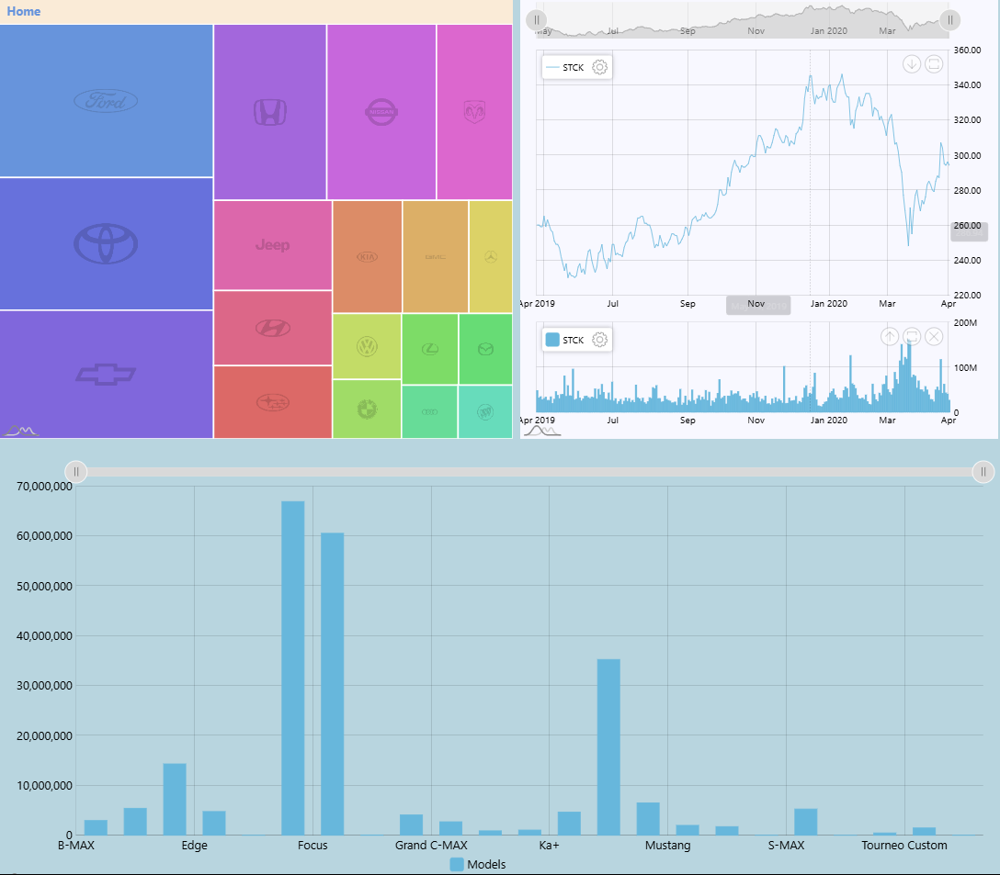

# DASH Board-AMCHARTS-5

A web application that visualizes stock market data and car sales information using Flask and AMCharts 5.

## Overview

This project is a data visualization dashboard that displays:
- Stock market data (Open, High, Low, Close, Volume)
- Car sales data by brand and model
- Ford model price analysis

## Images

### Dashboard Screenshots

*Main dashboard view showing stock market data and car sales visualization*

### Brand Logo

*Ford brand logo used in the application*

## Video Demonstration


https://github.com/user-attachments/assets/e05171f4-9429-4cd2-aada-d5c1dc379f23


*Watch the video above to see the dashboard in action*

## Features

- Interactive stock market charts
- Car sales visualization by brand and model
- Ford model price analysis dashboard
- Responsive web interface
- Real-time data updates

## Tech Stack

- **Backend**: Python Flask
- **Database**: SQLite
- **Data Processing**: Pandas, NumPy
- **Frontend**: HTML, JavaScript
- **Charts**: AMCharts 5

## Project Structure

```
DASH-AMCHARTS-5/
├── app.py              # Main Flask application
├── static/            # Static files (CSS, JS)
├── templates/         # HTML templates
│   ├── index.html    # Main dashboard page
│   ├── About.html    # About page
│   └── Layout.html   # Base template
├── images/           # Image assets
└── Data Files:
    ├── Stock.db              # Stock market data
    ├── Model_prices.db       # Car sales data
    ├── ford_model_prices.db  # Ford specific data
    ├── Data.csv             # Raw stock data
    ├── car_sales_data.csv   # Raw car sales data
    └── ford.csv             # Raw Ford data
```

## Setup and Installation

1. Clone the repository:
   ```bash
   git clone [repository-url]
   cd DASH-AMCHARTS-5
   ```

2. Install the required dependencies:
   ```bash
   pip install flask pandas numpy sqlalchemy
   ```

3. Run the application:
   ```bash
   python app.py
   ```

4. Open your browser and navigate to:
   ```
   http://localhost:5000
   ```

## API Endpoints

- `/` or `/index`: Main dashboard
- `/About`: About page
- `/get-datachart`: Stock market data
- `/get-datachart2`: Car sales data
- `/get-datachart3`: Ford model price data

## Data Sources

The application uses three main data sources:
1. Stock market data (Stock.db)
2. Car sales data (Model_prices.db)
3. Ford model price data (ford_model_prices.db)

## Contributing

Feel free to submit issues and enhancement requests!

## License

This project is licensed under the MIT License - see the LICENSE file for details. 
